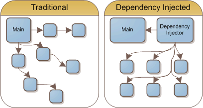

# Dependency-Injection
A basic example of dependency injection

The intent of this project is give an overview of IOC and Dependency Injection and provide a basic implementation.

# IOC: A Brief Overview
IOC, also known as inversion of control is what we are ultimately trying to accomplish when implementing dependency injection. We want to move the ownership of configuration or instantiation of an object out of a specific 
class and into an external entity like a container or the framework. From there, we can easily inject the dependency into any class that may need it because the dependency has been moved to the top of the dependency tree.
This is adventageous because this allows for easier abstraction of classes via interfaces, loosely coupled classes, and allows for much easier mocking of classes for testing. 

# Dependency Injection: Lifetimes
There are three different lifetime options you can use when registering a dependency. 

    Singleton - a dependency registered with the singleton lifetime will maintain the same configuraition for the lifetime of the request. I've used this option in the past to register a service 
    where I'm building out the header of an API call and inserting an auth token. The service could be used by multiple classes and still maintain the same auth token without creating unecessary computation
    to go fetch the token every time we need it.

    Transient - the transient lifetime is intended for objects that are expected to change over time. Historically I've seen this option used when registering a database. When in doubt, make it transient.

    Scoped - an object will remain the same as long as it is within the same scope. This would be great if you'd like to register some sort of cache service that will be maintained throughout the lifetime
    of the web request.

# Running the App
This is a really simple console application. Just make sure the DependencyInjection project is selected in the dropdown next to the 
run and debug buttons then press play and watch the output!

